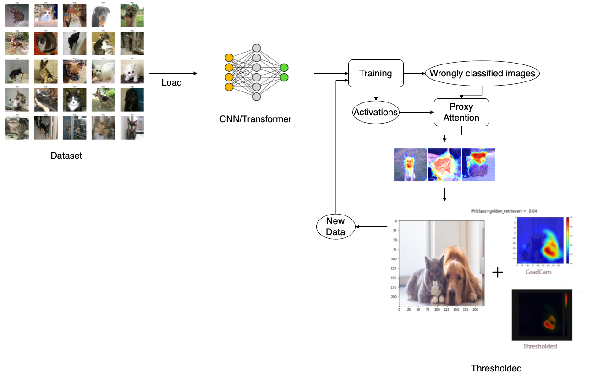

# Proxy Attention : Masters Thesis Project
- 
- Using outputs of XAI algorithms as part of the training process in order to simulate the effects of Attention for a NN.
- This is a work in progress and this README will reflect changes in code or methodology.
- Implemented using Pytorch (no training frameworks used although an implementation using fast.ai was also created as a prototype.)

## Research Questions
- Is it possible to create an augmentation technique based on Attention maps?
- Is it possible to approximate the effects of Attention from ViTs in a CNN?
- Is it possible to make a network converge faster and consequently require less data using the outputs from XAI techniques?
- Does Proxy Attention impact the explainability of the model in turn?

## How to Use
- Since all the scripts have not been written yet, for now it is just possible to open pure_pytorch_src/main.ipynb 
- src/main_runner.py can also be looked at although the implementation in EXTREMELY slow.

## Main code flow
- Select network architecture, dataset
- All the preprocessing
- Run n1 epochs of training
- Find worst performing examples -> Run XAI algorithm on them -> Apply Proxy Attention -> Save these to disk
- Run n2 epochs of training with old +- new examples

## Proxy Attention Defined
- $$Original Image[mean of XAI output along channels > threshold] = new value$$
- XAI output is the heatmap obtained by CAM/GradCAM etc
- new value can either be 0.0 or an average of pixels or max/min of pixels (needs to be tested)
- threshold is 0.008 for now

## Directory Structure
### Proposal
- In the report folder as main.pdf
### Main folder
- src is the main folder. 
- the runs folder has tensorboard logs. This will not be pushed to github for now to account for storage constraints.
- main.py is the main file to be run. 
- meta_utils.py has utility functions that are used multiple times and refactored in this file.
- training.py has the main training code.
- data_utils.py has code related to data loading and processing.

### Other branches
- A julia branch exists with most of the code also written in julia + flux
- This was abandoned as it proved to be too much to implement from scratch

## Implementation Progress
- [x] Data loader
- [x] Captum integration
- [x] Stratified kfold
- [x] Transfer learning
- [x] Basic config
- [x] Data augmentation
- [x] Implemented proxy attention using outputs from Captum
- [x] Training loop with the following optimizations
- [x] Gradient scaling
- [x] Mixed precision training
- [x] Progress bars 
- [x] Tensorboard logging (mostly)
- [x] Checkpoints
- [x] Number of epochs in between loops (Epochs -> Proxy -> Epochs ...)
- [x] Full proxy attention loop as a function
- [x] Select if modified images will be used as an augmentation or completely replace original images
- [x] Refactor properly
- [x] Vision Transformer
- [ ] More XAI Algorithms and networks
- [ ] Pruning based on weights?
- [ ] More datasets
- [ ] More information as logs
- [ ] Prevent overwriting logs
- [ ] More optimizations
- [ ] Support for more XAI algorithms
- [ ] Batch runner script